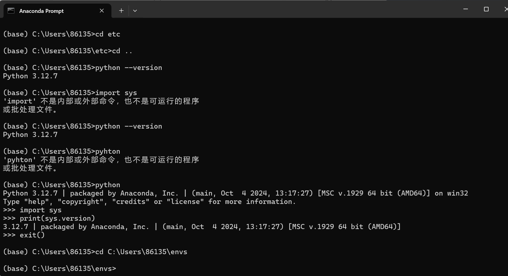
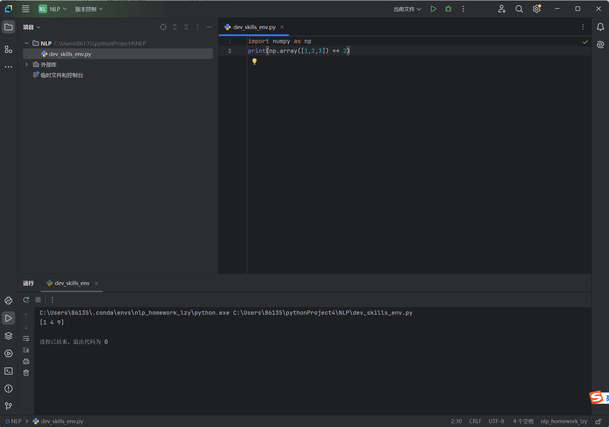

# 小八的自我介绍


 大家好，我是**小八~**，我的身份是*一只小猫*
___

## 基础档案

### 外貌特征
- 毛茸茸的白色身体
* 标志性蓝色的猫耳朵刘海
+ 尾巴是蓝色的

## 我的好朋友
1. 乌萨奇
2. 吉伊
3. ~~飞鼠~~（划掉：因为被夺走了身体）

### 重要坐标
[住址：chiikawa大世界](https://www.chiikawa.com)

### 日常作息表
| 时间 | 活动              |
|------|-----------------|
| 早晨 | 和吉伊一起晨练         |
| 中午 | 和吉伊，乌萨奇一起参加大型讨伐 |
| 晚上 | 自制美食            |

### 人生信条
> "和好朋友一直幸福快乐的生活！"


---

## 我的专业是讨伐奇美拉

## 我最喜欢的一段代码
```python
import numpy as np
print(np.array([1,2,3]) ** 2)
```
其中执行`print(np.array([1, 2, 3]) ** 2)`可输出结果。
___

## 我最喜欢的环境管理工具是conda


## 我可以在IDE上使用我建立的虚拟环境


##

